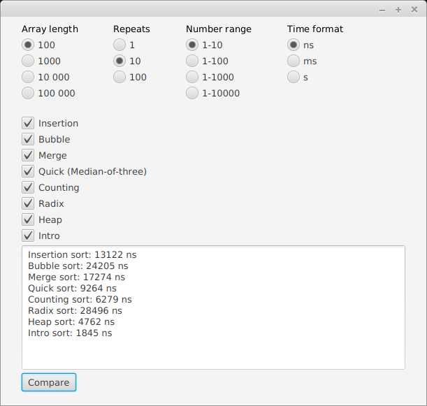

# Käyttöohje

## Ohjelman käynnistäminen

Suosittelen kloonaamaan projektin repositorion ja asentamaan ohjelman käyttäen sen mukana tulevaa gradle-wrapperia. Asennus ja ohjelman käynnistys onnistuu Sovellus-hakemistossa komennolla:

```
./gradlew run
```

Ilman gradle-wrapperia ohjelma ei välttämättä käynnisty, sillä sen käyttämä JavaFX-kirjasto vaatii vähintään gradlen version 5.

Ohjelman voi myös käynnistää lataamalla projektin releases-välilehdeltä sovelluksen jar-tiedoston ja suorittamalla sen komennolla:

```
java -jar vertailu.jar
```

Jar-tiedosto on luotu Linux-ympäristössä, joten se ei välttämättä toimi muilla käyttöjärjestelmillä. Jos haluaa itse luoda sovelluksesta suoritettavan jar-tiedoston, tulee kloonatun projektin Sovellus-hakemistossa suorittaa komento:

```
./gradlew shadowJar
```

Komento paketoi sovelluksen ja sen käyttämät riippuvuudet yhteen jar-tiedostoon, joka löytyy hakemistosta _build/libs/_

## Ohjelman toiminnot

Ohjelman avulla käyttäjä voi vertailla tiettyjen järjestämisalgoritmien aikavaativuuksia valitsemalla käyttöliittymästä eri asetuksia ja painamalla *Compare* painiketta.



### Asetukset

* *Array length* määrittää satunnaisgeneroitavan kokonaislukutalukon pituuden.

* *Repeats* määrittää suoritettavien toistojen määrän kullekin järjestämisalgoritmille. Toistojen välissä taulukko palautetaan alkuperäiseen järjestämättömään tilaan ja sovelluksen ilmoittama aika on näiden toistojen mediaani. Yhdellä toistolla mittaustulokset ovat liian epäluotettavia, joten suosittelen käyttämään asetuksena kymmentä toistoa. Sadalla toistolla aikaa voi kulua useita minuutteja riippuen siitä, montako algoritmia on valittuna.

* *Number range* määrittää taulukon sisältämien kokonaislukujen arvovälin. Asetus vaikuttaa lähinnä laskemis- ja kantalukujärjestämisen toimintaan.

* *Time format* määrittää tulostuksessa käytettävän ajan yksikön. Pienemmilla taulukoilla nanosekunti voi olla selkeämpi vaihtoehto, mutta suurempien taulukoiden järjestämiseen kuluu enemmän aikaa ja tulosten esittäminen millisekunteina voi siksi helpottaa niiden lukemista.

* *Compare* painike luo sitä painettaessa asetusten mukaisen satunnaisesti generoidun taulukon ja suorittaa ajan mittaamisen kullekin valitulle järjestämisalgoritmille. Tulokset tulostuvat lopulta sovelluksen tekstikenttään.

### Lisähuomautus

Jostain syystä sovellus ilmoittaa ensimmäisillä vertailukerroilla epätavallisen suuria aikoja. Suosittelen aluksi valitsemaan kaikki algoritmit ja tekemään pienimmällä taulukon koolla ja kymmenellä toistolla noin 7 vertailua, jonka jälkeen ajat näyttävät laskevan huomattavasti.